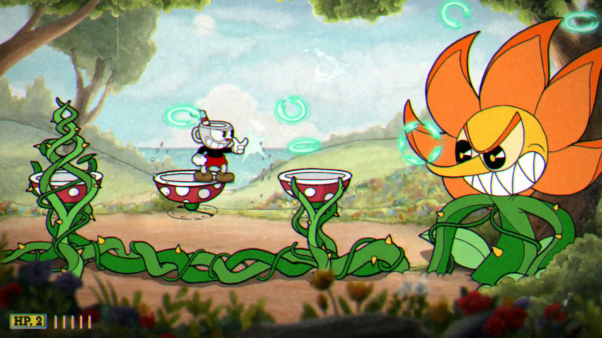

# 1.1 Problem Identification

## Why create a video game?

Firstly, the gaming industry has only grown since its introduction, with video games becoming much more accessible to all audiences as a result of gaming experiences being available on more and more devices including our mobile phones. The COVID-19 pandemic also served a major boost to video game sales and attracted many new people to the activity. The lockdown periods were the perfect time to pick up a new hobby, and gaming is an easily accessible activity that doesn't require a large amount of space to enjoy. In addition, online games spiked in popularity as they provided a great way to do something fun with friends while separated. During the lockdown that took place in June 2020, time spent gaming increased by double digits in all regions. (Clement)&#x20;

.png>)

Secondly, there are a multitude of mental health benefits that can come as a result of playing video games.&#x20;

Games, especially ones in the category of the game that i'm planning to create, are able to improve ones problem solving skills under pressure. Jane Mcgonigal, American game designer and author, stated in a TED talk that gamers are 'out of the box problem solvers'. She claimed that when playing games that require problem solving skills, players spend 80% of play time failing. This failure is made fun in the form of a game, and the more a player fails, the harder they try to form a solution to the problem. This is a valuable skill that can be used in real life. (Brooke, 2020)

.png>)

A great benefit that playing games (in healthy intervals) can provide is instant reward. Often in real life, people can sometimes feel that they're working so much for nothing, as they haven't yet received the long term benefits that are waiting for them down the line. This feeling of working for no reward can decrease motivation and lead to mental health issues such as depression. A harmless form of combatting these issues can be by playing video games. Many video games are designed to make sure that the next accomplishment is never too far away from the player. These virtual achievements and rewards can give the player the satisfaction they need to be motivated to keep working towards their real life goals and rewards. (Brennan, 2021)

My game would be an action packed game. Action games can strengthen the brain in multiple ways:

* Improvements in perceptual decision making, or the ability to identify and select targets
* Speed of processing, or how quickly one can respond to a target
* Ability to overcome attention capture, or how to maintain focus on a goal in the face of distractions
* Ability to remember visually presented information
* Ability to multitask and rapidly switch between two tasks

Whats most important about these benefits is that they equate to real life skills that can help with learning and working. (Uncapher)

