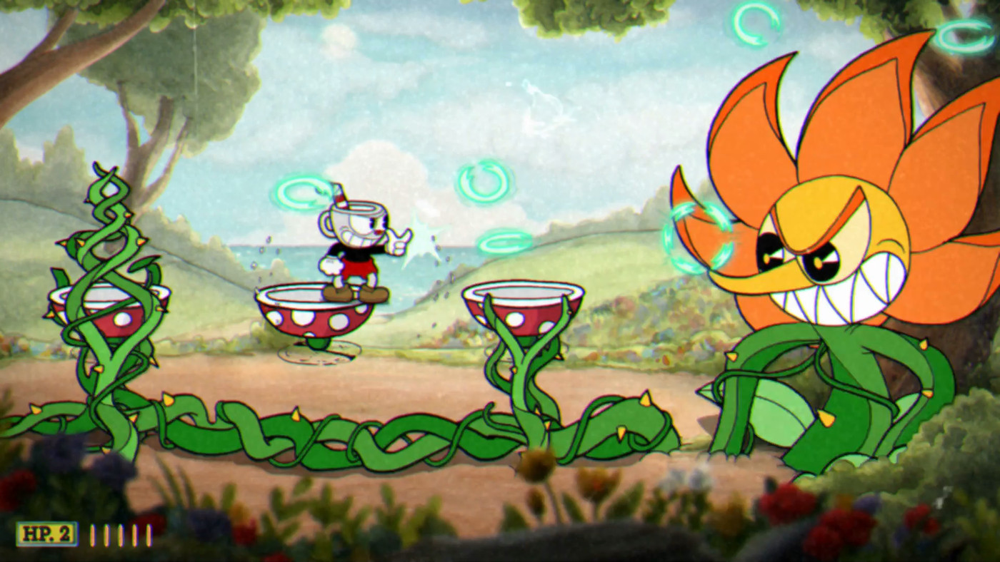

# 1.3 Research

Cuphead

### Overview

Cuphead is a single player (can also be played locally with a second player) game where the primary objective is to defeat al of the game's 19 bosses, with the games end being reached after defeating the final boss; the Devil. The game's main selling point was its very unique art style, with characters and the world being drawn in the style of 1950s cartoons and effects on the screen that increase the immersion by making the player feel like theyre playing on an old TV. This combined with the music and sound effects gives the game a nostalgic, disney like feeling to the game which makes boss fights out of the many wacky tropes of cartoon violence.

### Controls

The game can be played on controller or keyboard and mouse. On keyboard (which is the control input that my game will be using, the game uses the usual WASD keys for moving your character, and the mouse is used for aiming your attacks. Your basic attack is fired by holding the x key and your special attack is used by pressing V. You also have a dash that is used with LShift, and a parry which is used by pressing the jump key when making contact with certain objects marked in pink.&#x20;

### Boss Phases

Something that really makes the bosses in Cuphead stand out are different 'phases' that they involve. Each different phase of a fight changes the bosses look and gives them a brand new pool of attacks. For example, one boss fight starts with you fighting a bee police officer in a hive, then the queen bee, before the queen bee turns in to a literal bomber plane in the final phase.

### Customisation

Another enjoyable part of the game is the ability to change the type of weapon fire you can use, along with equipping 3 other items that can give you extra perks, such as more health or a better dash. Each different weapon comes with a unique basic fire and special attack. You can equip two weapon types at a type, being able to switch between them at any time during levels. This gives the game an extra sense of strategy as you can prepare your build accordingly for each challenge. The player can also choose between 1 of 3 SUPERS, ultimate moves that can be charged and released by stockpiling 5 special attack charges.

### Features



| Feature           | Justification                                                                                                                     |
| ----------------- | --------------------------------------------------------------------------------------------------------------------------------- |
| Boss fight phases | It keeps the boss fight feeling fresh and exciting while challenging. It will also be a good medium for implementing checkpoints. |
| Movement controls | Using WASD is convenient, and something that any PC gamers will already be familiarised with.                                     |
| SUPER move        | I like the idea of an extra powerful move that can be used only occasionally. It adds another strategic element to the game.      |



| Feature                           | Justification                                                                                                                                                                                                                                        |
| --------------------------------- | ---------------------------------------------------------------------------------------------------------------------------------------------------------------------------------------------------------------------------------------------------- |
| No checkpoints during boss fights | This is suitable for a game like Cuphead, where the bosses are difficult but not too long, whereas it would have a negative impact on my game that features one very long boss fight. This would ramp up the difficulty in a way i feel is too much. |
| Choose any build you want         | I want my game to feel chaotic and unexpected. For this reason, the player wont get to choose exactly what items and buffs they get, instead having to pick from random selections and improvise a little.                                           |
| Art style                         | The art style of cuphead is one that takes incredible amounts of time to complete. I will be using a pixelated art style as they are easier to make effective.                                                                                       |




## Dead Cells

.png>)

### Overview

Dead cells is a rogue-like combat platformer game in which the player must escape an island riddled with disease by battling through levels crawling with hostile enemies and defeating difficult bosses with intricate attack patterns. The player will find tons of different random weapons and items along their journey which they can mix and match in their build for powerful results. The game focuses a lot from dying, learning from your mistakes and getting stronger as you go back to the same prison room in the island every time you die. Although you return to the start each time, you collect permanent upgrades to your character and unlock new items as you play game.

### Controls

Dead cells can be played on controller, keyboard and mouse or on mobile devices. In dead cells you hold two weapons at the same time and can be used with two different buttons. You also have two 'skill' items that range from bombs to spells to traps, and can also be used with their own buttons but have cooldowns. There is a health flask that the player can use in order to assist them in the task of not dying. Some more controls are a dodge and a ground slam.

### Extra mechanics;

* Parrying: Shields can be used with the right timing to block an enemy attack, deal damage, and activate a special effect based on the shield being used.
* 'Safe areas': Although the game has no checkpoints, there is a safe area between each level of the island where the player can restore their health, refill their health flask, unlock new items.
* Mutations: These serve as choosable 'perk' items that can have powerful effects throughout the run and can be chosen by the player to support whatever play style  they choose.



| Feature                    | Justificication                                                                                                                                       |
| -------------------------- | ----------------------------------------------------------------------------------------------------------------------------------------------------- |
| Randomisation of weapons   | Dead cells has the same element of randomness and forces the player to improvise just like how i have planned my game to do.                          |
| Some sort of dodge ability | I feel that the ability to have a dash or dodge roll that grants a tiny period of invincibility would give my boss more potential for varied attacks. |
| Passive perks              | These will be similar to Mutations, but with a more random element to them.                                                                           |



| Feature     | Justification                                                                                                                        |
| ----------- | ------------------------------------------------------------------------------------------------------------------------------------ |
| Safe points | I want the player to constantly have to be thinking fast without breaks. The only time they get a break from the action is by dying. |
| Parrying    | I feel that this mechanic may be too difficult to implement, and id prefer to implement dodging attacks rather than blocking them.   |
| Skills      | As i am already planning to add an ultimate ability, i do not feel the need to add another cooldown ability.                         |




## Sonic COLOURS

.png>)

### Overview

Sonic Colours is a 2010 action platformer game where Sonic travels across a giant intergalactic theme park built by Doctor Eggman as a coverup for his plan to enslave an alien race and take over the world. The game has received a remastered edition in 2021 but Im going to be going off of the original. There are 6 main zones of the theme park that the player must clear, each with a unique boss fight at the end. The game is very fast paced, as to be expected from a Sonic game, and the player has to utilise Sonic's agile movement to dodge and attack the bosses.&#x20;

### Controls

The game had two separate versions, one for the Wii and one for the DS. Along with basic movements, the player has access to a homing attack, double jump and wall jump, a slide and ground slam, a quick step and a crouch. The player also has a massive speed boost that charges up over time. Once charged, it can be used on the ground or in the air to gain loads of ground. Finally, the player is able to use whatever wisp they are holding at any time they want.

### Powerups

One of Sonic Colour's selling points was the unique implementation of Wisps, power ups in the form of small aliens that would temporarily change the form of sonic and his abilities. For example, the DRILL wisp that turns Sonic into a big yellow drill that can travel through certain walls and surfaces to reach new areas, or the VOID wisp that turns Sonic into a moveable black hole that sucks up enemies and obstacles.



| Feature                   | Justification                                                                                                                                                                            |
| ------------------------- | ---------------------------------------------------------------------------------------------------------------------------------------------------------------------------------------- |
| Double jump               | Double jumping has become a popular mechanic in 2D action games as it is good for giving more feeling of freedom.                                                                        |
| Movement powerups         | Fast paced movement is going to be a big part of my game so id like a few powerups to reflect that.                                                                                      |
| Boss invincibility phases | The boss fights in Sonic Colours have sections where you cant attack the boss, and have to just dodge attacks until it's over. Id like to include sections like this into my boss fight. |



| Feature                 | Justification                                                                                                                                                        |
| ----------------------- | -------------------------------------------------------------------------------------------------------------------------------------------------------------------- |
| 3D elements             | Some of the levels and boss fights include 3D movement elements which i will not be implementing as I will be keeping my game strictly 2D.                           |
| Crouching, sliding, etc | Although i want my game to have fast and precise movement, i feel that having these controls might overcomplicate things, both in terms of development and gameplay. |
|                         |                                                                                                                                                                      |



